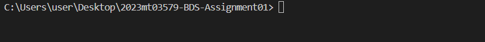
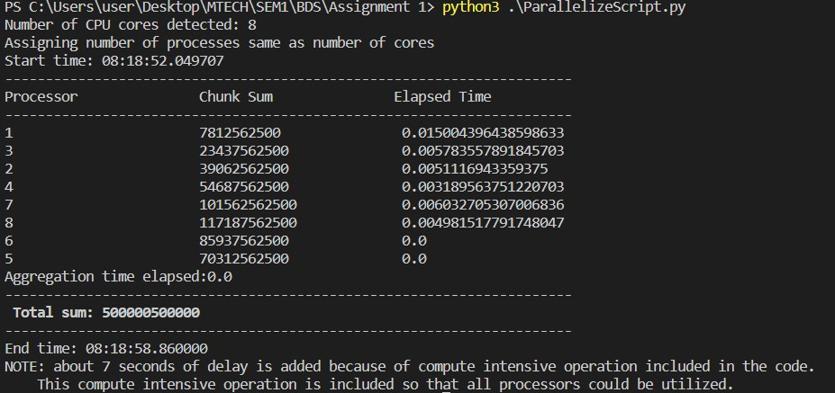

# Simulating Parallel Data Processing - Assignment

This assignment is to simulate a parallel data processing environment as part of assignment for the Big Data Systems subject of Mtech Sem1

Author: Abdul Kareem Muzammil

BITS ID: 2023mt03579

This assignment contains 2 sections:
 - Section 1: for simulation program
 - Section 2: to discuss how this simulation relates to Shared Memory and Message Passing concepts
<!-- TOC -->

- [Simulating Parallel Data Processing - Assignment](#simulating-parallel-data-processing---assignment)
    - [Section 1 - The Program](#section-1---the-program)
        - [Scenario](#scenario)
        - [Requirements](#requirements)
        - [Solution & Code Explanation](#solution--code-explanation)
            - [Import required libraries](#import-required-libraries)
            - [Main Function or Point of Entry](#main-function-or-point-of-entry)
                - [Initialize large data of array of numbers about 1 million integers.](#initialize-large-data-of-array-of-numbers-about-1-million-integers)
                - [Get number of system CPU cores.](#get-number-of-system-cpu-cores)
                - [Set number of processes](#set-number-of-processes)
                - [Invoking parallel_sum function](#invoking-parallel_sum-function)
                - [Printing the result](#printing-the-result)
            - [Parallel_Sum Function](#parallel_sum-function)
                - [Data Division](#data-division)
                - [Process in Parallel](#process-in-parallel)
                - [Aggregate the chunks](#aggregate-the-chunks)
            - [Sum Chunks function](#sum-chunks-function)
        - [Instructions to run the script](#instructions-to-run-the-script)
            - [Technical Prerequisites](#technical-prerequisites)
            - [Download the script](#download-the-script)
            - [Open Terminal or Command Prompt](#open-terminal-or-command-prompt)
            - [Run the script](#run-the-script)
        - [Results](#results)
        - [Tools & References](#tools--references)
    - [Section 2 - Discussion](#section-2---discussion)
        - [How this simulation relates to Shared Memory and Message Passing concepts](#how-this-simulation-relates-to-shared-memory-and-message-passing-concepts)
            - [Shared Memory](#shared-memory)
            - [Message Passing](#message-passing)

## Section 1 - The Program

### Scenario

To work with a dataset that is too large to process on a single machine. Its decided to simulate a parallel data processing environment using Python's multiprocessing library.

### Requirements

1. Write a Python script using Python's multi-processing library, that simulates the partitioning of data and its parallel processing. 
    - The script should divide a large array of numbers into smaller chunks, 
    - distribute these chunks across multiple processes for summing the numbers, and 
    - then aggregate the results. 
2. Discuss how this simulation relates to the concepts of Shared Memory and Message Passing.


### Solution & Code Explanation

Based on the above requirements, we need to partition the data and then process the partitions parallely. Therefore it needs data parallelism implementation and Python's multiprocessing library has an API called Pool that offers a convenient means of parallelizing the execution of a summing function across multiple data partitions, distributing the input data across processes (data parallelism).


#### Import required libraries

The program leverages the multiprocessing library from Python. Therefore, we need to import the same and additionally we import other libraries as required.

```python
"""
import required libraries
"""
import multiprocessing
import os
import datetime
import numpy as np
```

#### Main Function or Point of Entry 

This is the entry point for the program. Here we are doing:
##### 1. Initialize large data of array of numbers about 1 million integers.
```python
"""
Main function which is the entry point of the program.
"""
if __name__ == "__main__":
    
    # Initialize data: a large array of numbers
    data = list(range(1, 1000001))
```
##### 2. Get number of system CPU cores.

```python
 # Get number of system CPU cores
    nprocs = multiprocessing.cpu_count()
    print(f"Number of CPU cores detected: {nprocs}")
```

##### 3. Set number of processes

Setting up to have one process per CPU core, by setting num_processes to be the number of available CPU cores. Could be any finite number though. (limited to ulimit value)

```python
    # Number of processes to simulate parallelism
    # note:it is desirable to have one process per CPU core, so it is a good idea to set num_processes 
    # to be the number of available CPU cores
    num_processes = nprocs

    print("Assigning number of processes same as number of cores")
```
##### 4. Invoking parallel_sum function 

```python
    # Simulate parallel processing
    result = parallel_sum(data, num_processes)
    
```
##### 5. Printing the result 

```python
    # print Total sum
    print(f"\033[1m Total sum: {result} \033[0m \t")
```
#### Parallel_Sum Function

This function is to calculate sum of numbers parallely. It takes inputs:
1. data: list of numbers (usually very large)
2. num_processes: number of parallel processes to be created and executed in

and returns sum of numbers in the data list.

##### 1. Data Division
Divide the data into chunks
```python
def parallel_sum(data, num_processes):
    """Divide the data into chunks"""
    chunk_size = len(data) // num_processes
    chunks = [data[i:i+chunk_size] for i in range(0, len(data), chunk_size)]
```

##### 2. Process in Parallel

Use multiprocessing library in Python to pool number of processes and execute the sum_chunks function parallely. The sum_chunks will compute the sum of the chunks array and returns the sum value. Each sum_chunk will be aggregated by the parent process, finally.
```python
    """Process them in parallel"""
    with multiprocessing.Pool(processes=num_processes) as pool:
        results = pool.map(sum_chunk, chunks)


```
##### 3. Aggregate the chunks


```python
    """Aggregate the results."""
    total_sum = sum(results)
    return total_sum
```

#### Sum Chunks function

The sum_chunks will compute the sum of the chunks array and returns the sum value

```python
chunk_sum=sum(chunk)

```

NOTE: Adding CPU intensive operation like factorial of large number to be able to demonstrate that all cores of CPU
    are utilized. If we remove the factorial line, mthe sum operation is so fast that all cores of CPU are not utilized.

### Instructions to run the script

#### Technical Prerequisites

Make sure latest Python version is installed.

#### Download the script

Save the script in a folder.

#### Open Terminal or Command Prompt

Open Terminal or Command Prompt and navigate to the folder directory as shown below


#### Run the script

At the command prompt, run the script as below
```python
python3 .\ParallelizeScript.py
```

### Results

The output displays a table of various chunks and their respective sums processed by various processors.
It also displays the aggregated sum as total sum as shown below.




### Tools & References

1. VS Code 2019
2. Python 3
3. https://superfastpython.com/multiprocessing-in-python/

## Section 2 - Discussion

### How this simulation relates to Shared Memory and Message Passing concepts

This simulation relates to the concepts of Shared Memory and Message Passing as described below.

#### Shared Memory

1. In this simulation, the data is shared among the different processes. 
2. Each process gets its own chunk of data to process, and the results are aggregated to obtain the final outcome.
3. The multiprocessing.Pool in Python uses shared memory to distribute the data across processes. 
4. Each process has access to the shared data but operates independently on its assigned chunk.

#### Message Passing

1. Message passing involves communication between processes using messages. 
2. In this simulation, the processes do not explicitly communicate with each other during their execution.
3. However, the map function of multiprocessing.Pool implicitly involves message passing. 
4. The main process divides the data into chunks and sends them to worker processes, and the results are sent back to the main process for aggregation.


In summary, the simulation combines aspects of both Shared Memory (data sharing among processes) and Message Passing (implicit communication during the parallel processing). 

The multiprocessing library abstracts the underlying mechanisms, providing a convenient way to simulate parallelism in Python.