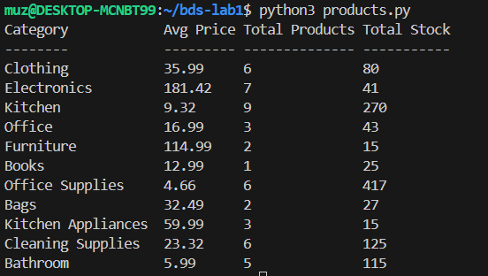

# Assignment: Enhanced Product Analysis with MapReduce


This assignment aims to introduce you to basic MapReduce concepts by analyzing product data with additional insights, as part of assignment for the Big Data Systems subject of Mtech Sem1

Author: Abdul Kareem Muzammil

BITS ID: 2023MT03579
<!-- TOC -->

- [Assignment: Enhanced Product Analysis with MapReduce](#assignment-enhanced-product-analysis-with-mapreduce)
    - [Scenario](#scenario)
    - [Dataset:](#dataset)
    - [Requirements](#requirements)
    - [Example Input & Output](#example-input--output)
        - [Input (products.csv)](#input-productscsv)
        - [Output:](#output)
    - [Instructions to Run the script](#instructions-to-run-the-script)
        - [Update HDFS Host and CSV File Path in the products.py](#update-hdfs-host-and-csv-file-path-in-the-productspy)
        - [Execute the python script](#execute-the-python-script)
        - [Output Result](#output-result)
    - [Solution & Code Explanation](#solution--code-explanation)
        - [Pre-requisites](#pre-requisites)
        - [Import required libraries](#import-required-libraries)
        - [Main Function or Point of Entry](#main-function-or-point-of-entry)
            - [1. Initialize HDFS host and CSV relative path.](#1-initialize-hdfs-host-and-csv-relative-path)
            - [2. Call Mapper function.](#2-call-mapper-function)
            - [2. Call Mapper function.](#2-call-mapper-function)
            - [3. Pass output from Mapper to Reducer function](#3-pass-output-from-mapper-to-reducer-function)
            - [4. Printing the result](#4-printing-the-result)
            - [4. Printing the result](#4-printing-the-result)
        - [Mapper Function](#mapper-function)
            - [1. Initialize HDFS client](#1-initialize-hdfs-client)
            - [2. Read CSV using client](#2-read-csv-using-client)
            - [3. Yielding the mapper result](#3-yielding-the-mapper-result)
            - [3. Yielding the mapper result](#3-yielding-the-mapper-result)
        - [Reducer function](#reducer-function)
    - [Appendix](#appendix)
        - [Setup Hadoop and HDFS on Ubuntu in WSL2](#setup-hadoop-and-hdfs-on-ubuntu-in-wsl2)
            - [1. Connect to WSL2](#1-connect-to-wsl2)
            - [2. Open Terminal in WSL2 in VS Code](#2-open-terminal-in-wsl2-in-vs-code)
            - [3. Download Hadoop](#3-download-hadoop)
            - [4. Open .bashrc file](#4-open-bashrc-file)
            - [5. Reload .bashrc](#5-reload-bashrc)
            - [6. Edit HDFS Configuration files](#6-edit-hdfs-configuration-files)
                - [hadoop-env.sh](#hadoop-envsh)
                - [core-site.xml](#core-sitexml)
                - [hdfs-site.xml](#hdfs-sitexml)
                - [mapred-site.xml](#mapred-sitexml)
                - [yarn-site.xml](#yarn-sitexml)
            - [7. Generate SSH keys & Configure](#7-generate-ssh-keys--configure)
            - [8. Prepare NameNode & Restart SSH](#8-prepare-namenode--restart-ssh)
            - [9. Start Hadoop](#9-start-hadoop)
            - [10. Validate Hadoop running](#10-validate-hadoop-running)
    - [Tools & References](#tools--references)

<!-- /TOC -->

## Scenario

You are an inventory manager for a company and need to analyze product data to understand sales trends and make informed decisions.

## Dataset: 
You are provided with a CSV file named "products.csv" containing the following information about each product:

 - product_id: Unique identifier for the product (integer)
 - product_name: Name of the product (string)
 - category: Category to which the product belongs (string)
 - price: Price of the product (float)
 - stock: Current stock level (integer)

## Requirements

1. Write a Hadoop Mapper Python script using Python HDFS library, that: 
    - Read each line from the "products.csv" file. 
    - Split the line into individual fields based on commas (",").
    - Extract the category, price, and stock from each record.
    - Emit a key-value pair where the key is the category and the value is a tuple containing the price and stock., 

2. Write a Hadoop Reducer Python script using Python HDFS library, that: 
    - Receive key-value pairs from the mapper, where the key is the category and the value is a list of tuples containing price and stock.
    - Calculate the average price, total number of products, and total stock for each category.
    - Print the results in the following format for each category:
        | category  | average_price | total_products | total_stock |
        | ------------- | ------------- | ------------- | ------------- |
        | --      | -- | -- | -- |
        
## Example Input & Output

### Input (products.csv)
1,Shirt,Clothing,19.99,10
2,Jeans,Clothing,39.99,5
3,Laptop,Electronics,699.99,2
4,Headphones,Electronics,49.99,8

### Output:
Clothing  39.99  2 15
Electronics  374.99  2  10

## Instructions to Run the script

### Update HDFS Host and CSV File Path in the products.py
Locate Main function and update *hdfs_host* and *hdfs_path* variables as shown in the below code.

*hdfs_host*: HDFS host url.

*hdfs_path*: relative path to the CSV.

```python
# Main Function
if __name__ == "__main__":
    # HDFS host and path
    hdfs_host = 'http://localhost:9870'
    hdfs_path = '/bds-lab1/products.csv'
```

### Execute the python script

Run the products.py as shown below using python3.
```python
python3 products.py
```


### Output Result




## Solution & Code Explanation

Based on the above requirements, we need to define mapper and reducer functions and implement the hadoop map and reduce concepts in Python. The mapper function reads data from a CSV file and yields key-value pairs with category as key and price and stock as values. Then, a reducer function processes these key-value pairs to calculate the average price, total number of products, and total stock for each category. Finally, it prints the results in the specified format.

### Pre-requisites

1. A working hadoop environment with a namenode and datanode and hdfs installed and set up. I have manually setup the Hadoop environment on Ubuntu in WSL2. This is explained in detail [here](#setup-hadoop-and-hdfs-on-ubuntu-in-wsl2). 

2. Make sure hdfs Python library is installed.
```bash
pip install hdfs
```

### Import required libraries

The program leverages the hdfs and csv libraries from Python. 

```python
"""
import required libraries
"""
from hdfs import InsecureClient
import csv
```

### Main Function or Point of Entry 

This is the entry point for the program. Here we are doing:
#### 1. Initialize HDFS host and CSV relative path.

Declare and assign the variables:

*hdfs_host*: HDFS host url.
*hdfs_path*: relative path to the CSV.

```python
"""
Main function which is the entry point of the program.
"""
# Main Function
if __name__ == "__main__":
    # HDFS host and path
    hdfs_host = 'http://localhost:9870'
    hdfs_path = '/bds-lab1/products.csv'
```
#### 2. Call Mapper function.

Call Mapper function by passing hdfs file path.

```python
    # pass input from products.csv in HDFS
    data = mapper(hdfs_host, hdfs_path)

```

#### 3. Pass output from Mapper to Reducer function

Send the Mapper result to Reducer.

```python
    # pass mapper output to reducer
    reduced_data = reducer(data)
```
#### 4. Printing the result 

```python
   # Printing the results
    format_string = "{:<20}{:<10}{:<15}{:<15}"
    print(format_string.format(*['Category','Avg Price','Total Products','Total Stock']))
    print(format_string.format(*['--------','---------','--------------','-----------']))
    for category, (avg_price, total_products, total_stock) in reduced_data.items():
        print(format_string.format(*[f'{category}',f'{avg_price:.2f}',f'{total_products}',f'{total_stock}']))
```
### Mapper Function

The mapper function reads data from a CSV file and yields key-value pairs with category as key and price and stock as values.

#### 1. Initialize HDFS client
Create an instance of insecureclient using the supplied HDFS host.
```python
# Mapper Function
def mapper(hdfs_host, hdfs_path):
    client = InsecureClient(hdfs_host)
```

#### 2. Read CSV using client

Reading CSV file from the HDFS file system, and using UTF-8 encoding.
```python
    with client.read(hdfs_path, encoding='utf-8') as file:
        
```
#### 3. Yielding the mapper result

Create a reader object and loop through the rows in the file reader. Extract category, price and stock values from each row and put it in data dictionary object.
```python
    reader = csv.reader(file)
        data = {}
        for row in reader:
            category = row[2]
            price = float(row[3])
            stock = int(row[4])
            if category not in data:
                data[category] = []
            data[category].append((price, stock))
        return data.items()
```

### Reducer function

The Reducer function processes these key-value pairs to calculate the average price, total number of products, and total stock for each category.
```python
# Reducer Function
def reducer(data):
    result = {}
    for category, values in data:
        total_price = 0
        total_stock = 0
        total_products = 0
        # loop through values - count stock, average price
        for value in values:
            price, stock = value 
            total_price += price
            total_stock += stock
            total_products += 1
        average_price = total_price / total_products
        result[category] = (average_price, total_products, total_stock)

    return result
```
## Appendix
### Setup Hadoop and HDFS on Ubuntu in WSL2

#### 1. Connect to WSL2 
Connect to WSL2 in Visual Studio Code 
#### 2. Open Terminal in WSL2 in VS Code

Open Terminal and run below prerequisites in the WSL2 Terminal.
```bash
sudo apt-get update
sudo apt-get install -y openssh-client openssh-server vim ssh -y
sudo apt install openjdk-11-jdk openjdk-11-jre
```

#### 3. Download Hadoop

Download hadoop.3.4.0.tar.gz, unzip and move to /usr/local, add permissions:


```bash
wget https://archive.apache.org/dist/hadoop/common/hadoop-3.4.0/hadoop-3.4.0.tar.gz
tar -xzf hadoop-3.4.0.tar.gz
sudo mv hadoop-3.4.0 hadoop
sudo mv hadoop /usr/local
sudo chmod 777 /usr/local/hadoop
```

#### 4. Open .bashrc file

```bash
sudo nano ~/.bashrc
```
Add below lines

```bash
export JAVA_HOME=/usr/lib/jvm/java-11-openjdk-amd64
export JRE_HOME=/usr/lib/jvm/java-11-openjdk-amd64/jre
export HADOOP_HOME=/usr/local/hadoop
export HADOOP_INSTALL=$HADOOP_HOME
export HADOOP_MAPRED_HOME=$HADOOP_HOME
export HADOOP_COMMON_HOME=$HADOOP_HOME
export HADOOP_HDFS_HOME=$HADOOP_HOME
export HADOOP_YARN_HOME=$HADOOP_HOME
export YARN_HOME=$HADOOP_HOME
export HADOOP_COMMON_LIB_NATIVE_DIR=$HADOOP_HOME/lib/native
export PATH=$PATH:$HADOOP_HOME/sbin:$HADOOP_HOME/bin
```

If permission to save denied then close without save and run below code and repeat above steps:
```bash
sudo chown -R hadoop ~/.bashrc
```

#### 5. Reload .bashrc

Reload the changes done above, create some directories for HDFS namenode. datanode, logs.

```bash
source ~/.bashrc
mkdir -p $HADOOP_HOME/hdfs/namenode
mkdir -p $HADOOP_HOME/hdfs/datanode
mkdir $HADOOP_HOME/logs
```

#### 6. Edit HDFS Configuration files

Change directory to the folder to edit multiple files.

```bash
cd $HADOOP_HOME/etc/hadoop
```

##### hadoop-env.sh

```bash
code hadoop-env.sh OR sudo nano hadoop-env.sh

```
Add this line in end of file (save and close):

```bash
export JAVA_HOME=/usr/lib/jvm/java-11-openjdk-amd64
```

##### core-site.xml
```bash
code core-site.xml OR sudo nano core-site.xml

```
Edit the configuration as below (save and close):

```xml
<configuration>
 <property>
 <name>fs.defaultFS</name>
 <value>hdfs://localhost:9000/</value>
 </property>
</configuration>
```

##### hdfs-site.xml
```bash
code hdfs-site.xml OR sudo nano hdfs-site.xml

```
Edit the configuration as below (save and close):

```xml
<configuration>
 <property>
 <name>dfs.namenode.name.dir</name>
 <value>file:///usr/local/hadoop/hdfs/namenode</value>
 <description>NameNode directory for namespace and transaction logs storage.</description>
 </property>
 <property>
 <name>dfs.datanode.data.dir</name>
 <value>file:///usr/local/hadoop/hdfs/datanode</value>
 <description>DataNode directory</description>
 </property>
 <property>
 <name>dfs.replication</name>
 <value>2</value>
 </property>
</configuration>
```

##### mapred-site.xml
```bash
code mapred-site.xml OR sudo nano mapred-site.xml

```
Edit the configuration as below (save and close):

```xml
<configuration>
 <property>
 <name>mapreduce.framework.name</name>
 <value>yarn</value>
 </property>
 <property>
 <name>yarn.app.mapreduce.am.env</name>
 <value>HADOOP_MAPRED_HOME=${HADOOP_HOME}</value>
 </property>
 <property>
 <name>mapreduce.map.env</name>
 <value>HADOOP_MAPRED_HOME=${HADOOP_HOME}</value>
 </property>
 <property>
 <name>mapreduce.reduce.env</name>
 <value>HADOOP_MAPRED_HOME=${HADOOP_HOME}</value>
 </property>
</configuration>
```

##### yarn-site.xml
```bash
code yarn-site.xml OR sudo nano yarn-site.xml

```
Edit the configuration as below (save and close):

```xml
<configuration>
 <property>
 <name>yarn.nodemanager.aux-services</name>
 <value>mapreduce_shuffle</value>
 </property>
 <property>
 <name>yarn.nodemanager.aux-services.mapreduce_shuffle.class</name>
 <value>org.apache.hadoop.mapred.ShuffleHandler</value>
 </property>
 <property>
 <name>yarn.resourcemanager.hostname</name>
 <value>localhost</value>
 </property>
</configuration>
```

#### 7. Generate SSH keys & Configure

Generate ssh key and add to authorized keys in Ubuntu:

```bash
cd ~
ssh-keygen -t rsa -P " -f ~/.ssh/id_rsa
cat ~/.ssh/id_rsa.pub >> ~/.ssh/authorized_keys
chmod 600 ~/.ssh/authorized_keys
```
Open these 2 files

```bash
code /etc/ssh/ssh_config OR sudo nano /etc/ssh/ssh_config
code /etc/ssh/sshd_config OR sudo nano /etc/ssh/sshd_config
```
and add in last line (save and close):

```bash
Port 2222
```

Open this file:
```bash
code ~/.ssh/config OR sudo nano ~/.ssh/config
```
and add below lines (save and close)

```bash
Host *
StrictHostKeyChecking no
```

#### 8. Prepare NameNode & Restart SSH

```bash
hdfs namenode -format
sudo /etc/init.d/ssh restart
```

#### 9. Start Hadoop

```bash
start-all.sh

```

On Restart of system, if you cant seem to run hdfs commands in Ubuntu, then try this lines:

```bash
sudo service ssh restart
start-all.sh
```

#### 10. Validate Hadoop running

Run below command to validate if hadoop is successfully configured and running.

```bash
jps
```

## Tools & References

1. VS Code 2019
2. Python 3
3. [Hadoop](https://hadoop.apache.org/)
